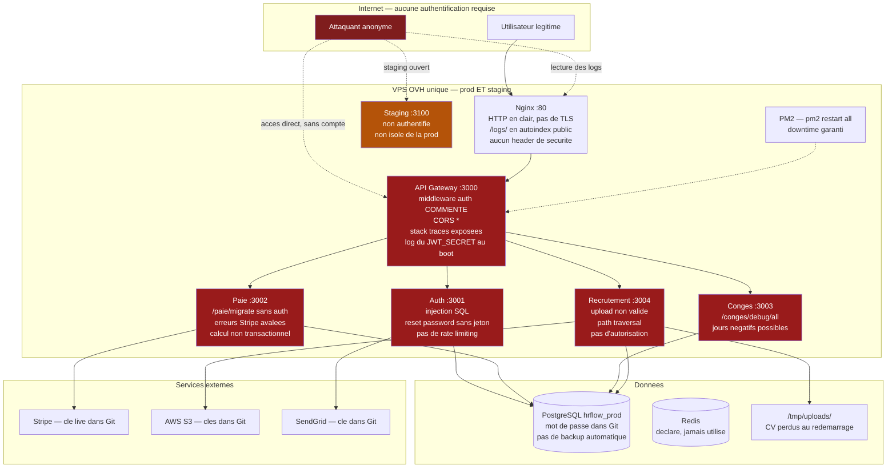
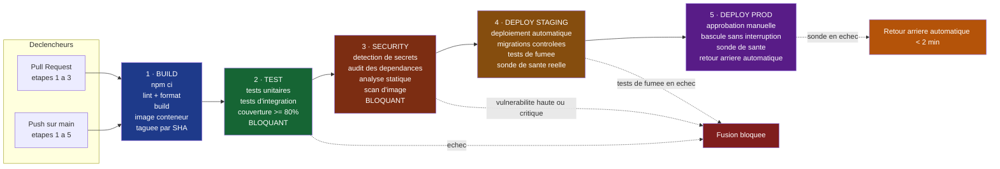
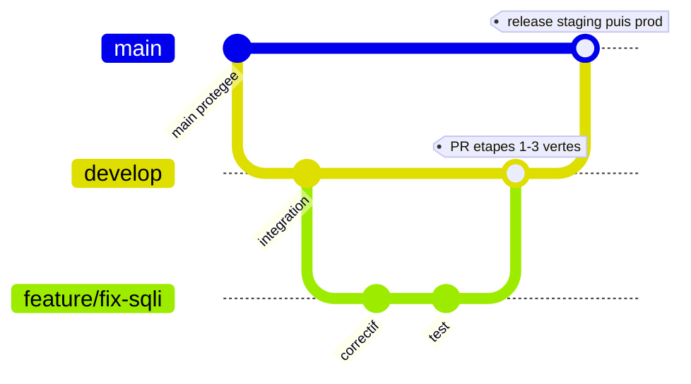

# Rapport d'audit technique — NovaTech HRFlow
### Livrable Jour 1 — Équipe BB_NUMERIQUE

| | |
|---|---|
| **Périmètre** | Repository `novatech-hrflow` (commit `6d3b57f`), branches `main`, `dev`, `feature/recrutement-v2` |
| **Méthode** | Revue de code manuelle exhaustive (100 % des fichiers), analyse de l'historique Git, revue des configurations d'infrastructure et de CI/CD, croisement avec le rapport TechAudit/Partech du 18/09/2024 et le post-mortem P1 du 16/08/2024 |
| **Volumétrie auditée** | 5 services Node.js, 1 frontend React, 1 pipeline GitHub Actions, 1 configuration Nginx, 1 script de déploiement, 5 commits |
| **Constats** | **51 problèmes distincts**, dont **12 non identifiés par l'audit Partech** |
| **Statut du système** | Non exploitable en production en l'état — exposition non authentifiée de l'intégralité des données RH |

---

## 1. Synthèse exécutive

### 1.1 Verdict

La plateforme HRFlow n'est pas un système fragile : c'est un système **ouvert**. À la date de l'audit, un attaquant sans compte, sans outil particulier et sans connaissance préalable du système peut, en moins de dix minutes :

1. **lire l'intégralité des données RH de tous les clients** (`GET /conges/debug/all`, sans authentification) ;
2. **prendre le contrôle de n'importe quel compte**, y compris administrateur (`POST /auth/reset-password`, sans jeton de vérification) ;
3. **provoquer une coupure totale de la plateforme** (`POST /paie/migrate`, sans authentification — c'est le vecteur exact de l'incident P1 du 14 août) ;
4. **forger des jetons d'authentification valides**, le `JWT_SECRET` étant publié dans l'historique Git depuis octobre 2021.

Ces quatre expositions ne relèvent pas de la dette technique : ce sont des vulnérabilités actives, exploitables aujourd'hui, sur un système traitant des données à caractère personnel de 8 200 salariés. La déclaration CNIL en cours d'examen porte donc sur un risque toujours ouvert au moment où nous écrivons.

### 1.2 Notation

| Domaine | Partech (sept. 2024) | Notre évaluation | Écart |
|---|---|---|---|
| Sécurité | 🔴 1/10 | 🔴 **0,5/10** | Partech a manqué 2 vulnérabilités critiques (takeover de compte, upload non contrôlé) |
| Tests & qualité | 🔴 1/10 | 🔴 **0,5/10** | La gate de test est inopérante *par construction*, pas seulement absente |
| CI/CD | 🔴 2/10 | 🔴 **1/10** | Le pipeline ne peut techniquement pas builder le frontend |
| Infrastructure | 🟠 3/10 | 🟠 **2/10** | Le script de déploiement staging déploie en production |
| Documentation | 🟡 2/10 | 🟡 **2/10** | Confirmé |
| **Global** | **🔴 1,8/10** | **🔴 1,2/10** | |

### 1.3 Les cinq risques à traiter en priorité absolue

| # | Risque | Impact si exploité | Délai de correction |
|---|---|---|---|
| 1 | Secrets de production publiés dans Git (SEC-01) | Compromission totale : BDD, AWS, Stripe (`sk_live_`), e-mail | **H+2** |
| 2 | Prise de contrôle de compte sans jeton (SEC-03) | Accès administrateur, exfiltration, fraude à la paie | **H+4** |
| 3 | Route de migration SQL non authentifiée (SEC-04) | Rejeu de l'incident P1 : 3 h de coupure, perte de données | **H+1** |
| 4 | Fuite RGPD de l'intégralité des données RH (SEC-05) | Violation caractérisée, sanction CNIL, résiliations | **H+1** |
| 5 | Absence totale de détection (INF-01) | MTTD constaté : **2 h 28** — l'incident est découvert par un client | **J+4** |

### 1.4 Chiffres clés issus de l'incident P1

| Indicateur | Valeur constatée | Objectif Partech | Écart |
|---|---|---|---|
| MTTD (temps de détection) | 2 h 28 | < 2 min | ×74 |
| MTTR (temps de rétablissement) | 3 h 07 | < 10 min | ×19 |
| RPO (perte de données) | 1 h 17 | < 15 min | ×5 |
| Couverture de tests | 0 % | ≥ 80 % | — |

---

## 2. Méthodologie

L'audit a été conduit en quatre passes distinctes, volontairement séparées pour éviter l'effet de tunnel :

1. **Passe documentaire** — lecture du post-mortem P1 et du rapport Partech *avant* le code, afin d'identifier les hypothèses à vérifier.
2. **Passe code, à froid** — relecture ligne à ligne des 5 services et du frontend, **sans** se référer à la liste Partech, pour ne pas se contenter de confirmer une liste existante. C'est cette passe qui a produit les 12 constats supplémentaires.
3. **Passe infrastructure** — CI/CD, Nginx, script de déploiement, historique Git, arborescence (fichiers manquants, répertoires vides, dépendances mortes).
4. **Passe de croisement** — réconciliation avec Partech, arbitrage des divergences de criticité, priorisation par **exploitabilité × impact**, et non par facilité de correction.

> **Note de méthode.** Les commentaires présents dans le code (`// à retirer`, `// TODO`, `// !!!`) ont été traités comme des **indices**, jamais comme des preuves. Chaque constat a été vérifié dans le code lui-même. Plusieurs problèmes majeurs ne sont signalés par aucun commentaire — ce sont précisément les plus dangereux, car personne dans l'équipe précédente n'en avait conscience.

---

## 3. Architecture de l'existant

### 3.1 Schéma des flux actuels

### 3.2 Ce que le schéma révèle

Trois constats structurels, invisibles fichier par fichier mais évidents à l'échelle du système :

1. **La gateway n'est pas un point de contrôle, c'est un simple relais.** Son middleware d'authentification étant commenté depuis mars 2024, elle transmet toute requête sans vérification. Or **aucun service en aval ne vérifie l'identité de l'appelant** : chacun suppose que la gateway l'a fait. La sécurité repose donc sur une garantie que personne ne fournit.
2. **Les services sont directement joignables.** Ils écoutent sur toutes les interfaces (comportement par défaut d'Express) sans pare-feu documenté : même une gateway correctement sécurisée serait contournable en appelant les ports `3001` à `3004` directement.
3. **Production et staging partagent la même machine, la même configuration et vraisemblablement la même base.** Un incident de staging est un incident de production.

### 3.3 Périmètre réel du code

| Composant | Lignes | Routes exposées | Routes protégées | Tests |
|---|---|---|---|---|
| api-gateway | 44 | 1 (`/health`) + 4 proxys | **0** | 0 |
| auth | 76 | 3 | **0** | 0 |
| paie | 79 | 2 | **0** | 0 |
| conges | 63 | 3 | **0** | 0 |
| recrutement | 46 | 3 | **0** | 0 |
| frontend | 53 | — | — | 2 tests factices |
| **Total** | **361** | **16** | **0** | **0 réel** |

**Aucune des 16 routes exposées ne vérifie l'identité ou les droits de l'appelant.**

---

## 4. Registre des vulnérabilités et défauts

Criticité : 🔴 Critique (exploitable immédiatement, impact majeur) · 🟠 Élevé · 🟡 Moyen · ⚪ Faible.
La colonne « P » indique si le constat figure dans le rapport Partech (✔) ou s'il s'agit d'un constat propre à notre audit (**★**).

### 4.1 Sécurité

| ID | Crit. | P | Constat | Localisation |
|---|---|---|---|---|
| SEC-01 | 🔴 | ✔ | Secrets de production commités et présents dans tout l'historique Git : mot de passe PostgreSQL, Redis, `JWT_SECRET`, clés AWS, **clé Stripe `sk_live_`**, SendGrid, SMTP. Le `.gitignore` exclut volontairement `.env` de l'exclusion, avec commentaire assumé | `.env`, `.gitignore:16` |
| SEC-02 | 🔴 | ✔ | Injection SQL non authentifiée : requête construite par concaténation de chaîne sur un champ contrôlé par l'attaquant | `auth/src/index.js:23-25` |
| SEC-03 | 🔴 | **★** | **Prise de contrôle de compte** : `POST /auth/reset-password` réinitialise le mot de passe de n'importe quelle adresse e-mail, sans jeton, sans vérification de propriété, sans authentification. Le nouveau mot de passe est écrit en clair dans les logs applicatifs | `auth/src/index.js:63-74` |
| SEC-04 | 🔴 | ✔ | Migration SQL déclenchable par HTTP sans authentification. **Vecteur exact de l'incident P1 du 14 août.** Le script contient un `UPDATE` sans clause `WHERE` sur toute la table `employees` | `paie/src/index.js:64-77` |
| SEC-05 | 🔴 | ✔ | `GET /conges/debug/all` retourne la jointure complète congés × employés de **tous les clients**, sans authentification. Violation RGPD caractérisée (art. 32) | `conges/src/index.js:58-61` |
| SEC-06 | 🔴 | ✔ | Middleware d'authentification de la gateway commenté depuis mars 2024 ; aucun service en aval ne compense | `api-gateway/src/index.js:16-17` |
| SEC-07 | 🔴 | **★** | **Upload de fichier non contrôlé** : aucune validation de type MIME, aucune limite de taille, nom de fichier d'origine réutilisé tel quel → **traversée de répertoire** (`../../`) et dépôt de fichier arbitraire ; déni de service par saturation disque | `recrutement/src/index.js:12-18` |
| SEC-08 | 🟠 | **★** | **Absence de contrôle d'accès horizontal et de cloisonnement multi-locataire** : aucune route ne vérifie que l'appelant a le droit d'accéder à `:employeeId` ni ne filtre par entreprise cliente. Un utilisateur légitime d'un client A lit et modifie les données d'un client B | tous les services |
| SEC-09 | 🟠 | ✔ | Secrets codés en dur en valeur de repli — le système reste compromis même après nettoyage du `.env` | `auth:15`, `auth:41`, `auth:55`, `paie:52` |
| SEC-10 | 🟠 | ✔ | `JWT_SECRET` écrit en clair dans les logs au démarrage de la gateway | `api-gateway/src/index.js:43` |
| SEC-11 | 🟠 | ✔ | CORS permissif : origines, méthodes **et** en-têtes à `*` | `api-gateway/src/index.js:8-13` |
| SEC-12 | 🟠 | ✔ | Traces d'exécution complètes renvoyées au client en production | `api-gateway/src/index.js:32-39` |
| SEC-13 | 🟠 | **★** | Aucune limitation de débit ni protection contre la force brute sur `/auth/login`, ni verrouillage de compte, ni journal d'authentification exploitable | `auth/src/index.js:19` |
| SEC-14 | 🟠 | ✔ | Trafic en HTTP clair, aucune redirection HTTPS, aucun certificat : identifiants et jetons transitent en clair | `nginx/hrflow.conf:3-8` |
| SEC-15 | 🟠 | ✔ | `/logs/` exposé publiquement avec `autoindex on` : les journaux applicatifs contiennent e-mails, rôles et mots de passe réinitialisés (cf. SEC-03) | `nginx/hrflow.conf:18-21` |
| SEC-16 | 🟠 | ✔ | Staging accessible sans authentification, sur le même serveur que la production | `nginx/hrflow.conf:24-38` |
| SEC-17 | 🟡 | ✔ | Aucun en-tête de sécurité HTTP : CSP, HSTS, X-Frame-Options, X-Content-Type-Options, Referrer-Policy | `nginx/hrflow.conf` |
| SEC-18 | 🟡 | **★** | Jeton JWT stocké dans `localStorage` : accessible à tout script tiers, donc volable par XSS ; aucune expiration côté client | `frontend/src/components/Login.jsx:17-18` |
| SEC-19 | 🟡 | **★** | `jsonwebtoken@8.5.1` obsolète (CVE-2022-23529, -23540, -23541) ; `jwt.verify` appelé sans restriction d'algorithme | `auth/package.json`, `auth:55` |
| SEC-20 | 🟡 | **★** | Données à caractère personnel journalisées en clair (adresse e-mail, rôle) sans politique de rétention ni anonymisation | `auth/src/index.js:46` |
| SEC-21 | 🟡 | **★** | Aucun mécanisme de révocation de jeton ; validité 24 h ; `JWT_REFRESH_SECRET` déclaré mais jamais utilisé — un jeton volé reste valide une journée entière | `auth/src/index.js:39-43` |

### 4.2 Qualité logicielle

| ID | Crit. | P | Constat | Localisation |
|---|---|---|---|---|
| QUA-01 | 🔴 | **★** | **Aucune route asynchrone n'est protégée par `try/catch`.** Express 4 n'intercepte pas les rejets de promesse : toute requête malformée (corps vide, base indisponible, `password_hash` nul) provoque un `unhandledRejection` et **l'arrêt du processus**. Déni de service atteignable par une requête unique, sur les 5 services | tous les services |
| QUA-02 | 🔴 | **★** | **Calcul de paie erroné** : taux de cotisations approximatifs et non actualisés (22 % / 42 %), aucune gestion des arrondis, ni du temps partiel, ni des heures supplémentaires, ni de la CSG/CRDS. Risque de redressement URSSAF et contentieux prud'homal, au-delà du défaut de test | `paie/src/index.js:22-27` |
| QUA-03 | 🟠 | ✔/**★** | Erreurs Stripe silencieusement avalées : **le bulletin est émis même si le virement échoue**. Partech signale l'erreur avalée ; nous ajoutons l'**absence de clé d'idempotence**, qui rend tout rejeu susceptible de déclencher un **double virement** | `paie/src/index.js:46-58` |
| QUA-04 | 🟠 | **★** | Écriture non transactionnelle : insertion du bulletin puis appel de paiement hors transaction. Une interruption entre les deux laisse la base incohérente | `paie/src/index.js:40-54` |
| QUA-05 | 🟠 | **★** | **Faille métier sur les congés** : `nombreJours` est calculé par simple soustraction de dates. Des dates inversées produisent une valeur **négative**, qui *augmente* le solde du salarié. Par ailleurs aucun contrôle de chevauchement, aucun contrôle de solde disponible, et `joursEnAttente` n'est pas déduit du solde affiché | `conges/src/index.js:31-49` |
| QUA-06 | 🟠 | ✔ | 0 % de couverture backend ; les deux tests frontend sont des `expect(true).toBe(true)` — commentés comme « test vide pour éviter l'erreur CI » | `frontend/src/__tests__/login.test.js:16,21` |
| QUA-07 | 🟠 | **★** | **La gate de test est inopérante par construction** : `npm test` à la racine exécute `echo 'No tests found' && exit 0`. Même réactivée dans le pipeline, elle serait verte quoi qu'il arrive | `package.json` |
| QUA-08 | 🟠 | **★** | **Aucun fichier de verrouillage de dépendances** dans tout le dépôt : les builds ne sont pas reproductibles et les versions installées en production sont inconnues | racine et 6 sous-projets |
| QUA-09 | 🟡 | **★** | **Le frontend n'est pas constructible** : `frontend/public/` et `frontend/src/pages/` sont vides, il n'existe aucun point d'entrée `src/index.js`. L'étape « Build frontend » du pipeline échoue ou ne produit rien d'exploitable | `frontend/` |
| QUA-10 | 🟡 | ✔ | Code mort : `api-gateway/src/middleware/` et `routes/` vides, `axios` et `path` importés sans usage, lien de contournement d'authentification laissé en commentaire dans le formulaire de connexion | `Login.jsx:47`, `api-gateway/src` |
| QUA-11 | 🟡 | **★** | Absence de pagination sur `GET /recrutement/candidats` : la totalité de la table est sérialisée à chaque appel | `recrutement/src/index.js:31-35` |
| QUA-12 | 🟡 | ✔ | Requêtes non optimisées sur les congés : trois requêtes séquentielles, `SELECT *`, aucun cache alors que Redis est provisionné et inutilisé | `conges/src/index.js:14-16` |
| QUA-13 | 🟡 | **★** | Aucun lint, aucun formatage, aucune convention de commit ; numéros de version incohérents entre la racine (2.4.1), le frontend (2.1.0) et les services (1.0.0 à 0.9.2) — aucune stratégie de version | dépôt entier |
| QUA-14 | ⚪ | **★** | Journalisation non structurée (`console.log`), sans niveau, sans horodatage normalisé, sans identifiant de corrélation : le diagnostic d'incident distribué est impossible | tous les services |

### 4.3 Chaîne d'intégration et de déploiement

| ID | Crit. | P | Constat | Localisation |
|---|---|---|---|---|
| CIC-01 | 🔴 | ✔ | Déploiement automatique en production à chaque `push`, sans aucune barrière de qualité, sans approbation, sans possibilité d'annulation | `.github/workflows/deploy.yml` |
| CIC-02 | 🔴 | ✔ | La branche `dev` déclenche le déploiement **en production** — ajout accidentel jamais corrigé | `deploy.yml:14` |
| CIC-03 | 🟠 | ✔ | Étape de tests commentée depuis janvier 2022, motif documenté : « les tests cassaient le pipeline » | `deploy.yml` |
| CIC-04 | 🟠 | ✔ | Authentification SSH par mot de passe stocké en secret GitHub, au lieu d'une clé ou d'une fédération d'identité OIDC | `deploy.yml` |
| CIC-05 | 🟠 | **★** | Action tierce référencée sur une branche mutable : `appleboy/ssh-action@master`. Toute modification amont s'exécute automatiquement **avec les accès de production** — vecteur de compromission de chaîne d'approvisionnement | `deploy.yml` |
| CIC-06 | 🟠 | **★** | **Aucun artefact immuable** : le pipeline « construit » puis le serveur exécute `git pull` et reconstruit lui-même. Ce qui est testé n'est jamais ce qui est déployé, et il n'existe aucun objet versionné vers lequel revenir | `deploy.yml` |
| CIC-07 | 🟡 | ✔ | Node.js 16 (fin de support septembre 2023) ; `actions/checkout@v2` et `actions/setup-node@v2` dépréciés | `deploy.yml` |
| CIC-08 | 🟡 | ✔ | Aucune analyse de sécurité : ni détection de secrets, ni analyse de composition logicielle, ni analyse statique, ni scan d'image | `deploy.yml` |
| CIC-09 | 🟡 | **★** | Aucun environnement GitHub déclaré, aucune approbation manuelle, aucun contrôle de concurrence (deux déploiements simultanés possibles), aucune protection de branche | dépôt / configuration |
| CIC-10 | 🟡 | **★** | Aucune stratégie d'étiquetage ni de publication : impossible de dire quelle version est en production | dépôt |

### 4.4 Infrastructure et exploitation

| ID | Crit. | P | Constat | Localisation |
|---|---|---|---|---|
| INF-01 | 🔴 | ✔/**★** | Aucune supervision ni alerte. Partech le constate ; nous ajoutons que **la sonde de santé est mensongère** : `/health` renvoie systématiquement 200, sans vérifier aucun service en aval. Toute supervision branchée dessus serait aveugle | `api-gateway/src/index.js:26-29` |
| INF-02 | 🔴 | ✔ | Aucune sauvegarde automatique, aucun test de restauration depuis la création du système. RPO réel constaté lors du P1 : 1 h 17 de données perdues | infrastructure |
| INF-03 | 🔴 | ✔ | Aucune procédure de retour arrière. MTTR constaté : 3 h 07 | infrastructure |
| INF-04 | 🟠 | ✔ | Déploiement manuel depuis le poste d'une seule personne : `sshpass` avec mot de passe en clair et `StrictHostKeyChecking=no` — désactivation explicite de la vérification d'hôte, donc vulnérabilité à l'interception | `scripts/deploy.sh:17-21` |
| INF-05 | 🟠 | **★** | **Le script accepte un argument d'environnement qu'il n'utilise jamais.** `ENV` est lu ligne 11, affiché ligne 15, puis ignoré : l'adresse IP de production est codée en dur et le serveur exécute `git pull origin main`. **Lancer `deploy.sh staging` déploie la production** | `scripts/deploy.sh:11,15,24,26` |
| INF-06 | 🟠 | ✔ | `pm2 restart all` redémarre tous les services simultanément : interruption de service systématique à chaque déploiement | `deploy.sh`, `deploy.yml` |
| INF-07 | 🟠 | ✔ | Staging non isolé : même machine, même configuration Nginx, aucune séparation de données documentée | `nginx/hrflow.conf` |
| INF-08 | 🟡 | **★** | Aucune conteneurisation : environnements non reproductibles, ports codés en dur dans le code applicatif, adresses `localhost` en dur dans la gateway, aucune découverte de service | tous les services |
| INF-09 | 🟡 | **★** | Aucune limite de ressources, aucun délai d'expiration proxy, aucun `client_max_body_size` — combiné à SEC-07, saturation disque triviale | `nginx/hrflow.conf` |
| INF-10 | 🟠 | ✔ | Facteur d'autobus égal à 1 : toute la connaissance du système reposait sur Théo Marchand, qui a quitté l'entreprise. Le README renvoie littéralement à « Voir Théo » | organisation |

### 4.5 Documentation et conformité

| ID | Crit. | P | Constat | Localisation |
|---|---|---|---|---|
| DOC-01 | 🟠 | ✔ | README daté de mars 2022, instructions inexactes : il demande `cp .env.example .env` alors que ce fichier n'existe pas ; le déploiement renvoie à une personne partie | `README.md` |
| DOC-02 | 🟠 | ✔ | Aucun manuel d'exploitation, aucune procédure d'incident, aucune procédure de retour arrière — les cinq actions décidées après le P1 sont toutes à l'état « non réalisé » | `docs/incident-aout-2024.md` |
| DOC-03 | 🟡 | ✔ | `architecture.md` réduit à « TODO — à documenter proprement », inchangé depuis 2021 | `docs/architecture.md` |
| DOC-04 | 🟡 | ✔ | Aucune spécification d'API (OpenAPI/Swagger) : les contrats d'interface ne sont nulle part | dépôt |
| DOC-05 | 🟡 | **★** | Aucun journal de décision d'architecture, aucun `CONTRIBUTING`, `CODEOWNERS` ni gabarit de demande de fusion : rien n'encadre la contribution | dépôt |
| DOC-06 | 🟡 | **★** | Aucun registre de traitement ni politique de rétention, alors que le système stocke des CV et journalise des données personnelles — exigence directe du RGPD (art. 30), dans un contexte de contrôle CNIL en cours | organisation |

### 4.6 Répartition

| Criticité | Nombre | Part |
|---|---|---|
| 🔴 Critique | 12 | 24 % |
| 🟠 Élevé | 21 | 41 % |
| 🟡 Moyen | 17 | 33 % |
| ⚪ Faible | 1 | 2 % |
| **Total** | **51** | |

---

## 5. Les douze constats absents du rapport Partech

Cette section est volontairement isolée : elle constitue la valeur ajoutée de notre audit par rapport à l'existant.

| ID | Constat | Pourquoi Partech a pu le manquer | Pourquoi il compte |
|---|---|---|---|
| SEC-03 | Prise de contrôle de compte via `/auth/reset-password` | La route « fonctionne » et ressemble à une fonctionnalité normale ; le défaut est l'**absence** d'un jeton, pas la présence d'un mauvais code | Plus grave que l'injection SQL : ne demande aucune compétence technique |
| SEC-07 | Upload sans validation, traversée de répertoire | Le fichier `recrutement` est le plus court du dépôt ; l'audit se concentre sur `auth` et `paie` | Dépôt de fichier arbitraire sur le serveur de production |
| SEC-08 | Absence de cloisonnement multi-locataire | Ne se voit sur aucune ligne précise : c'est un défaut d'**architecture**, visible seulement en lisant les 5 services ensemble | Une fuite entre clients d'un SaaS RH est une violation RGPD systémique |
| SEC-13 | Aucune limitation de débit sur l'authentification | Défaut d'absence, pas de présence | Rend la force brute triviale, y compris après correction de SEC-02 |
| SEC-18/19/21 | Jeton en `localStorage`, `jsonwebtoken` obsolète, aucune révocation | Le frontend a été considéré hors périmètre | La chaîne d'authentification reste cassée même après correction du backend |
| QUA-01 | Arrêt du processus sur rejet de promesse non géré | Comportement propre à Express 4, invisible sans connaître ce piège précis | Déni de service par une requête unique, sur les 5 services |
| QUA-02 | Calcul de paie faux | Partech note « 0 test » sans lire la logique métier | Le vrai risque n'est pas l'absence de test : ce sont les **bulletins déjà émis** |
| QUA-03 | Absence d'idempotence sur les paiements Stripe | Partech signale l'erreur avalée, pas le rejeu | Un simple retry peut payer deux fois un salarié |
| QUA-05 | Solde de congés augmentable par dates inversées | Nécessite de dérouler mentalement le calcul de dates | Fraude exploitable par tout salarié, sans outil |
| QUA-07 | `npm test` renvoie toujours 0 | Partech regarde le pipeline, pas le `package.json` racine | **Réactiver les tests dans le pipeline ne sert à rien tant que ce n'est pas corrigé** |
| QUA-09 | Frontend non constructible | Suppose de vérifier l'existence des fichiers, pas seulement de lire ceux présents | Le pipeline actuel ne peut pas réussir : le « build » est décoratif |
| INF-05 | `deploy.sh staging` déploie la production | Le script *paraît* gérer les environnements | Un déploiement « de test » écrase la production |

> **Argument de soutenance.** Ces douze constats montrent que l'équipe n'a pas relu le rapport Partech mais **audité le système**. Trois d'entre eux (QUA-07, QUA-09, INF-05) invalident directement des remédiations que l'on serait tenté d'appliquer en confiance : réactiver les tests, s'appuyer sur le build existant, déployer d'abord en staging.

---

## 6. Plan de remédiation

### 6.1 Principe de priorisation

L'ordre retenu n'est ni celui du rapport Partech, ni l'ordre de facilité. Il découle de trois règles :

1. **On referme d'abord ce qui est ouvert.** Tant que les secrets de production sont publics et que quatre routes non authentifiées sont exposées, tout autre travail est cosmétique : un pipeline exemplaire déployant un système ouvert reste un système ouvert.
2. **On ne teste pas du code qu'on va réécrire.** Écrire des tests avant de corriger les vulnérabilités reviendrait à figer le comportement défectueux dans la suite de tests.
3. **On n'automatise pas un déploiement dont on ne sait pas revenir en arrière.** La procédure de retour arrière précède la mise en place du déploiement automatique — c'est la leçon directe du P1 : la panne n'a pas duré 3 h 07 à cause de la migration, mais parce que personne ne savait l'annuler.

### 6.2 Vagues de remédiation

```mermaid
gantt
    title Plan de remediation — 5 jours
    dateFormat X
    axisFormat J%d
    section V0 Endiguement
    Rotation des secrets + purge historique  :crit, v0a, 0, 1
    Suppression routes debug et migrate      :crit, v0b, 0, 1
    Gel du deploiement automatique           :crit, v0c, 0, 1
    section V1 Vulnerabilites
    SQLi, takeover, autorisation, CORS       :crit, v1, 1, 2
    Upload, cloisonnement, rate limiting     :crit, v1b, 1, 2
    section V2 Filet de securite
    Tests routes critiques, lint, lockfiles  :active, v2, 2, 3
    Pipeline 5 etapes avec gates bloquantes  :active, v2b, 2, 3
    section V3 Infrastructure
    Conteneurisation et staging isole        :v3, 3, 4
    Deploiement sans interruption + rollback :v3b, 3, 4
    section V4 Observabilite
    Sondes reelles, supervision, alertes     :v4, 4, 5
    section V5 Documentation
    README, OpenAPI, runbook, ADR            :v5, 4, 5
```

#### Vague 0 — Endiguement (H+0 → H+4) — *avant toute autre chose*

| Action | Constats traités | Justification |
|---|---|---|
| Révocation et rotation de **tous** les secrets (BDD, Redis, JWT, AWS, Stripe, SendGrid, SMTP) | SEC-01, SEC-09 | Les secrets sont publics depuis 2021 ; on ne « retire » pas un secret d'un historique Git, on le **révoque** |
| Retrait de `.env` du suivi Git, correction du `.gitignore`, création d'un `.env.example` | SEC-01, DOC-01 | Empêche la récidive |
| Purge de l'historique (`git filter-repo`), rotation des accès, invalidation des jetons émis | SEC-01 | Traite l'exposition passée |
| Suppression pure et simple de `/conges/debug/all` et `/paie/migrate` | SEC-04, SEC-05 | Aucune de ces routes n'a de raison d'exister : on ne les sécurise pas, on les supprime |
| Retrait de `dev` des déclencheurs de déploiement + suspension du déploiement automatique | CIC-01, CIC-02 | On arrête de propager avant de réparer |

> **Décision assumée** : la rotation des secrets passe avant la correction de l'injection SQL, bien que cette dernière soit techniquement plus « spectaculaire ». Motif : la clé Stripe `sk_live_` et les clés AWS sont exploitables **sans passer par l'application**.

#### Vague 1 — Fermeture des vulnérabilités critiques (J1 → J2)

| Action | Constats traités |
|---|---|
| Requêtes SQL paramétrées sur l'ensemble des services | SEC-02 |
| Réécriture du parcours de réinitialisation de mot de passe : jeton à usage unique, durée limitée, envoi hors journal, réponse indifférenciée pour empêcher l'énumération de comptes | SEC-03, SEC-20 |
| Réactivation d'un middleware d'authentification sur la gateway **et** vérification indépendante dans chaque service (défense en profondeur) | SEC-06, SEC-08 |
| Contrôle d'autorisation : vérification que l'appelant est bien le titulaire ou détient le rôle requis ; filtrage systématique par locataire | SEC-08 |
| Encadrement du `try/catch` de toutes les routes asynchrones + gestionnaire d'erreurs global sans divulgation | QUA-01, SEC-12 |
| CORS restreint à une liste d'origines explicite | SEC-11 |
| Upload : liste blanche de types MIME, limite de taille, nom de fichier régénéré, stockage hors arborescence web | SEC-07 |
| Limitation de débit et verrouillage progressif sur `/auth/login` | SEC-13 |
| Suppression du log du `JWT_SECRET` et des valeurs de repli codées en dur ; échec explicite au démarrage si un secret manque | SEC-09, SEC-10 |
| Correction des défauts métier : jours de congés négatifs, chevauchements, contrôle de solde ; arrondis et idempotence sur la paie | QUA-02, QUA-03, QUA-04, QUA-05 |

#### Vague 2 — Filet de sécurité (J2 → J3)

| Action | Constats traités |
|---|---|
| Correction de `npm test` à la racine (**préalable indispensable** : sans cela toute gate reste verte) | QUA-07 |
| Tests unitaires et d'intégration sur les routes critiques des 4 services, seuil de couverture bloquant ≥ 80 % | QUA-06 |
| Génération et versionnement des fichiers de verrouillage ; passage à `npm ci` | QUA-08 |
| Lint, formatage, convention de commit, protection de branche | QUA-13, CIC-09 |
| Pipeline en 5 étapes avec barrières bloquantes (§7) | CIC-01→CIC-10 |
| Réparation du frontend (point d'entrée, `public/index.html`) ou exclusion explicite et documentée du périmètre | QUA-09 |

#### Vague 3 — Infrastructure (J3 → J4)

Conteneurisation des 5 services, isolation réelle du staging (réseau et base séparés), déploiement sans interruption (bascule bleu/vert ou déploiement progressif), **procédure de retour arrière documentée puis testée en conditions réelles**, sauvegardes horaires avec test de restauration, durcissement Nginx (TLS, en-têtes, suppression de `/logs/`, authentification du staging, limites de taille et délais d'expiration).
→ INF-02 à INF-09, SEC-14 à SEC-17

#### Vague 4 — Observabilité (J4 → J5)

Sonde de santé réelle interrogeant chaque dépendance, exposition de métriques, journalisation structurée avec identifiant de corrélation, supervision et alerte avec objectif de détection inférieur à 2 minutes, astreinte définie.
→ INF-01, QUA-14

#### Vague 5 — Documentation (J4 → J5, en parallèle)

README opérationnel, spécification OpenAPI des 16 routes, manuel d'exploitation et procédure d'incident, journal des décisions d'architecture, schémas d'architecture, registre de traitement RGPD.
→ DOC-01 à DOC-06

### 6.3 Ce que nous ne ferons pas, et pourquoi

Un plan crédible énonce aussi ses renoncements :

- **Pas de migration vers Kubernetes.** Cinq services, 8 200 utilisateurs, une équipe qui vient de perdre son unique expert : la complexité opérationnelle ajoutée dépasserait le bénéfice. Conteneurs et orchestration simple suffisent.
- **Pas de réécriture du service de paie.** La logique est fausse, mais elle doit être corrigée **sous couverture de tests**, avec validation d'un expert-comptable — pas réécrite dans l'urgence par des développeurs.
- **Pas de correction de l'historique des bulletins déjà émis** dans le périmètre technique : c'est une décision juridique et comptable qui appartient à la direction. Nous la signalons, nous ne la tranchons pas.
- **Pas de refonte du frontend.** Hors périmètre de la remédiation exigée par Partech ; nous documentons son état non constructible comme dette assumée.

---

## 7. Architecture cible du pipeline

### 7.1 Les cinq étapes

### 7.2 Correspondance entre chaque étape et les défauts corrigés

| Étape | Barrière | Empêche concrètement |
|---|---|---|
| 1 · Build | `npm ci` sur fichier de verrouillage, artefact immuable tagué par empreinte de commit | CIC-06, QUA-08 : ce qui est testé est exactement ce qui est déployé |
| 2 · Test | Couverture bloquante ≥ 80 % sur les routes critiques | CIC-03, QUA-06, QUA-07 : le rejeu de la régression « heures supplémentaires » (commit `30e906c`, annulé après incident P2) |
| 3 · Security | Détection de secrets, audit de composition, analyse statique, scan d'image | SEC-01, SEC-02, SEC-19 : un secret commité fait échouer la fusion, pas la production |
| 4 · Deploy staging | Environnement réellement isolé, tests de fumée, sonde réelle | INF-05, INF-07, SEC-16 : plus jamais de « staging » qui déploie la production |
| 5 · Deploy prod | Approbation manuelle, bascule sans interruption, retour arrière automatique | CIC-01, CIC-02, INF-03, INF-06 : le scénario du 14 août devient impossible |

### 7.3 Stratégie de branchement retenue

- `main` protégée : aucun envoi direct, fusion par demande de fusion uniquement, étapes 1 à 3 obligatoires, une revue requise.
- `develop` : intégration continue, déploiement automatique en staging.
- `feature/*`, `fix/*`, `hotfix/*` : branches courtes, une intention par branche.
- Étiquetage sémantique à chaque publication, pour rendre identifiable la version en production (CIC-10).

**Justification** : une variante allégée de GitFlow. Un modèle à branche unique (*trunk-based*) serait préférable à terme, mais suppose une couverture de tests mature et une culture de la petite modification fréquente — que cette équipe n'a pas encore. On adopte le modèle correspondant au niveau de maturité réel, pas au modèle idéal.

---

## 8. Critères de succès

Reprise point par point des exigences du §6 du rapport Partech, formulées en critères vérifiables :

| # | Exigence Partech | Critère mesurable | Preuve attendue |
|---|---|---|---|
| 1 | Rotation des secrets | Aucun secret dans le dépôt ni dans l'historique ; détection automatisée dans le pipeline | Étape 3 verte, historique purgé |
| 2 | Pipeline complet | 5 étapes, barrières bloquantes, déploiement staging puis production | Exécution verte de bout en bout |
| 3 | Couverture ≥ 80 % | Seuil bloquant configuré sur les 4 services | Rapport de couverture |
| 4 | Détection < 2 min | Alerte déclenchée lors d'un test de panne provoquée | Capture de l'alerte, horodatage |
| 5 | Zero-downtime + rollback < 10 min | Retour arrière **testé**, pas seulement documenté | Chronométrage du test |
| 6 | Vulnérabilités critiques fermées | Les 12 constats critiques traités et vérifiés | Registre à jour |
| 7 | Documentation | OpenAPI, README, manuel d'exploitation | Fichiers livrés |

---

## 9. Annexes

### 9.1 Chronologie de la dette

| Date | Événement | Trace |
|---|---|---|
| Oct. 2021 | Création du dépôt, `.env` commité dès le premier commit | `f418406` |
| Oct. 2021 | Pipeline créé — « TODO : ajouter des tests un jour » | `deploy.yml` |
| Jan. 2022 | Tests désactivés « car ils cassaient le pipeline » | `deploy.yml` |
| Mars 2022 | Dernière mise à jour du README | `README.md` |
| Nov. 2023 | Refactorisation cassant les tests frontend, jamais réparés | `login.test.js` |
| Mars 2024 | Middleware d'authentification commenté « temporairement » | `api-gateway/src/index.js:17` |
| Juin 2024 | Incident lié au staging non authentifié | `nginx/hrflow.conf` |
| Juin 2024 | Ajout accidentel de `dev` aux déclencheurs de déploiement | `deploy.yml:14` |
| Juil. 2024 | Ajout de l'endpoint de debug « à retirer » | `conges/src/index.js:57` |
| 14 août 2024 | **Incident P1** — 3 h 07 de coupure, 8 200 utilisateurs | post-mortem |
| 26 août 2024 | Départ du CTO — aucune action correctrice engagée | post-mortem |
| 18 sept. 2024 | Audit Partech — gel de 1,8 M€ | rapport d'audit |

**Lecture** : aucun de ces problèmes n'est apparu par surprise. Tous étaient connus, documentés dans le code par leurs propres auteurs, et repoussés. La défaillance n'est pas technique, elle est **processuelle** : rien dans la chaîne n'empêchait de livrer du code défectueux. C'est exactement ce que le pipeline cible corrige.

### 9.2 Inventaire des secrets à révoquer

| Secret | Type | Exposition | Action |
|---|---|---|---|
| `DB_PASSWORD` | PostgreSQL production | Git depuis 2021 + repli codé en dur | Rotation + audit des connexions |
| `REDIS_PASSWORD` | Redis production | Git depuis 2021 | Rotation |
| `JWT_SECRET` | Signature de jetons | Git + repli + **journalisé au démarrage** | Rotation + invalidation de tous les jetons |
| `JWT_REFRESH_SECRET` | Signature | Git | Rotation |
| `AWS_ACCESS_KEY_ID` / `AWS_SECRET_ACCESS_KEY` | AWS | Git | Révocation immédiate + revue CloudTrail |
| `STRIPE_SECRET_KEY` | **Clé live de paiement** | Git + repli codé en dur | **Révocation immédiate + revue des transactions** |
| `STRIPE_WEBHOOK_SECRET` | Stripe | Git | Rotation |
| `SENDGRID_API_KEY` | Envoi d'e-mails | Git | Révocation (risque d'usurpation) |
| `SMTP_PASS` | SMTP OVH | Git | Rotation |

### 9.3 Documents de référence

- `docs/incident-aout-2024.md` — post-mortem P1
- `docs/audit-partech-septembre-2024.md` — audit TechAudit / Partech
- `CONSIGNES-ETUDIANTS.md` — cadrage de mission

---

*Rapport d'audit J1 — Équipe BB_NUMERIQUE — NovaTech HRFlow — Document interne*
