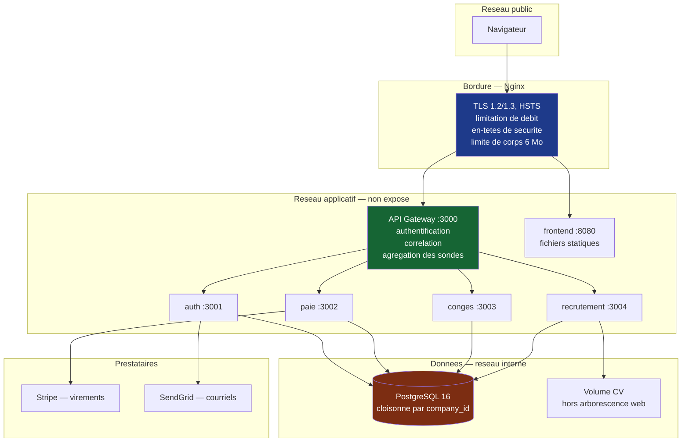
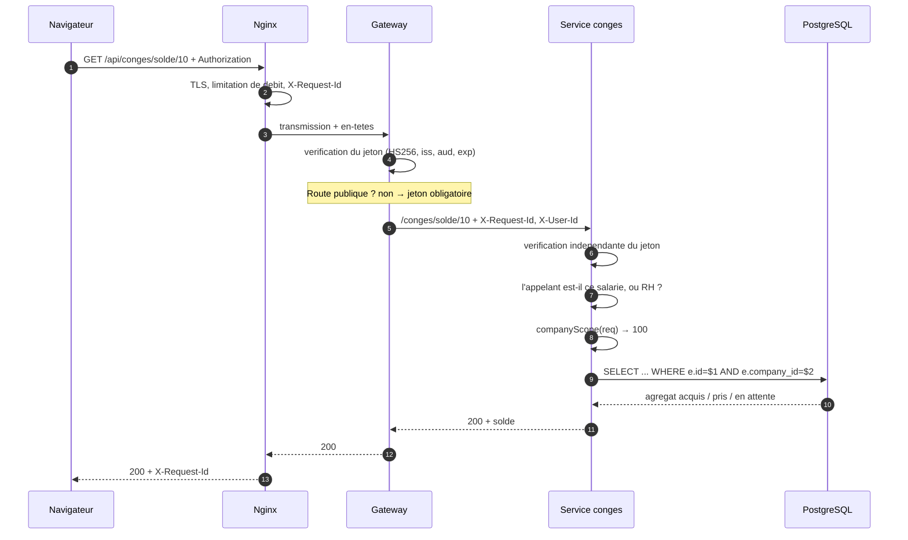
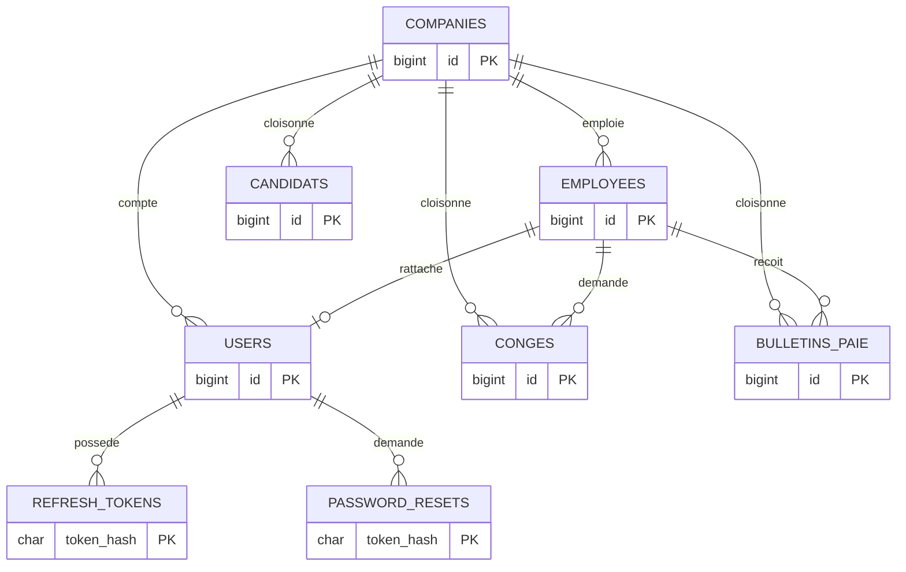

# Architecture HRFlow

> Ce document remplace la version de 2021, qui tenait en une ligne :
> « TODO — à documenter proprement », suivie de « PostgreSQL. Voir Théo pour le
> schéma » (constat DOC-03). Théo a quitté l'entreprise le 26 août 2024.

---

## 1. Vue d'ensemble

**Trois différences structurelles avec le système audité :**

1. **Les services métier ne sont plus joignables depuis l'extérieur.** Ils
   écoutaient auparavant sur toutes les interfaces, sans pare-feu documenté :
   une passerelle correctement sécurisée aurait été contournable en appelant
   directement les ports 3001 à 3004.
2. **La passerelle authentifie, et chaque service revérifie.** Redondance
   volontaire : l'incident vient de ce que les services supposaient une
   vérification qui n'avait plus lieu depuis mars 2024.
3. **Le staging est un environnement distinct**, avec sa propre base et sa
   propre authentification — il partageait auparavant la machine, la
   configuration et vraisemblablement la base de la production.

---

## 2. Parcours d'une requête authentifiée

Le même identifiant de corrélation traverse les quatre couches : une trace
Nginx, une trace de passerelle et une trace de service se relient. Le
diagnostic distribué était impossible auparavant (`console.log` sans contexte).

---

## 3. Services

| Service | Port | Responsabilité | Dépendances |
|---|---|---|---|
| `api-gateway` | 3000 | Authentification, routage, corrélation, sondes agrégées | les 4 services |
| `auth` | 3001 | Connexion, jetons, réinitialisation, verrouillage de compte | PostgreSQL, SendGrid |
| `paie` | 3002 | Calcul de bulletins, ordres de virement idempotents | PostgreSQL, Stripe |
| `conges` | 3003 | Soldes, demandes, validations | PostgreSQL |
| `recrutement` | 3004 | Candidatures, dépôt de CV | PostgreSQL, volume CV |
| `shared` | — | Configuration, journalisation, authentification, erreurs, base | — |

### Pourquoi un paquet partagé

Dans le système audité, chaque service réimplémentait — ou omettait —
l'authentification, la gestion d'erreurs et la configuration. Les omissions
étaient donc **invisibles** : rien ne distinguait un service qui avait oublié de
vérifier un jeton d'un service qui n'en avait pas besoin.

Centraliser rend l'oubli repérable : un service qui n'importe pas `requireAuth`
se voit en une ligne à la revue. C'est un choix de conception fait pour la
détectabilité, pas seulement pour éviter la duplication.

---

## 4. Modèle de données

Trois principes appliqués au schéma :

1. **`company_id` sur chaque table métier, en tête d'index.** Support du
   cloisonnement multi-locataire : sans cette colonne, aucun filtrage
   applicatif fiable n'est possible.
2. **Les règles métier critiques sont aussi des contraintes de base.**
   `date_fin >= date_debut` et `nombre_jours > 0` rendent la fraude aux congés
   impossible même si une version future du code oubliait le contrôle. Une
   contrainte de base ne se commente pas « temporairement ».
3. **Unicité `(employee_id, mois, annee)` sur les bulletins.** Dernière barrière
   contre un double virement, indépendante de la clé d'idempotence applicative.

Détail complet : [`db/migrations/001_schema_initial.sql`](../db/migrations/001_schema_initial.sql).

---

## 5. Authentification et autorisation

| Élément | Choix | Motif |
|---|---|---|
| Algorithme | HS256, explicitement contraint | sans contrainte, un jeton `alg: none` peut être accepté |
| Durée du jeton d'accès | 15 minutes | un jeton volé était exploitable 24 h |
| Renouvellement | jeton opaque, stocké haché, révocable | permet la révocation, impossible auparavant |
| Revendications | `sub`, `employeeId`, `companyId`, `role` | `companyId` porte le cloisonnement |
| Stockage côté navigateur | mémoire uniquement | `localStorage` est lisible par tout script |

Trois niveaux d'autorisation :

- `requireAuth` — le demandeur est authentifié ;
- `requireRole('rh', 'admin')` — il détient un rôle habilité ;
- `requireSelfOrRole('employeeId', 'rh')` — il est le titulaire, ou habilité.

`companyScope(req)` lève une erreur si le contexte client est indéterminé :
l'oubli devient une erreur visible, jamais une fuite silencieuse.

---

## 6. Environnements

| | Développement | Staging | Production |
|---|---|---|---|
| Exécution | Docker Compose local | machine dédiée | machine dédiée |
| Base | conteneur jetable | instance propre | instance dédiée, sauvegardée |
| Secrets | `.env` local | environnement GitHub `staging` | environnement GitHub `production` |
| Accès | poste du développeur | authentification HTTP + restriction IP | public en HTTPS |
| Déploiement | `docker compose up` | automatique après les étapes 1 à 3 | approbation manuelle |
| Données | jeu de démonstration | anonymisées | réelles |

Le staging audité était sur la même machine que la production, avec la même
configuration Nginx et sans authentification : c'est la cause de l'incident de
juin 2024.

---

## 7. Choix assumés et limites connues

| Sujet | Décision | Motif |
|---|---|---|
| Orchestration | Docker Compose, pas Kubernetes | 5 services, 8 200 utilisateurs, une équipe qui vient de perdre son seul expert : la complexité ajoutée dépasserait le bénéfice |
| Empreintes de mot de passe | `bcryptjs` | même algorithme que les empreintes existantes, donc aucune migration ; pas de compilation native, donc build reproductible |
| Journalisation | implémentation interne | une dépendance de moins dans une chaîne dont c'est justement le défaut |
| Validation | implémentation interne | périmètre restreint et connu ; même raisonnement |
| Barème de paie | repris à l'identique | corriger un taux sans validation comptable remplacerait une erreur par une autre |
| Temps partiel | refusé, non calculé | mieux vaut ne pas émettre de bulletin qu'en émettre un faux |
| Redis | provisionné mais inutilisé | conservé dans l'inventaire ; la mise en cache viendra quand une mesure la justifiera |

---

## 8. Évolutions identifiées

| Sujet | Bénéfice | Condition |
|---|---|---|
| Jeton de renouvellement en cookie `httpOnly` | supprime l'inconvénient de la session en mémoire sans réintroduire l'exposition au XSS | ADR-003 |
| Épinglage des actions par empreinte | supprime le dernier risque de chaîne d'approvisionnement | outillage de mise à jour |
| Cache Redis sur les soldes | réduit la charge sur PostgreSQL | mesure préalable de la charge réelle |
| Traçage distribué (OpenTelemetry) | diagnostic à travers les services | supervision en place |
| Migration vers un modèle à branche unique | cycle plus court | couverture de tests mature et culture de la petite modification |

---

*Architecture HRFlow — à mettre à jour à chaque décision structurante (voir [ADR.md](ADR.md)).*
